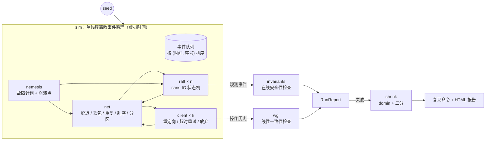

# hourglass ⏳

**面向 Raft 复制 KV 存储的确定性模拟测试（Deterministic Simulation Testing）框架**
—— 用一个 `u64` 种子重放整个分布式集群的一生：网络、时钟、崩溃、分区，以及所有 bug。

[](https://github.com/jiangfengz/claude-cloud-test/actions/workflows/ci.yml)


分布式系统的 bug 往往藏在"某个节点恰好在投完票后崩溃、而另一条消息恰好被延迟了 120ms"这样的交错里：
传统集成测试几乎撞不上，撞上了也无法复现。FoundationDB、TigerBeetle（VOPR）、Antithesis 的答案是
**确定性模拟**：把整个集群放进单线程、虚拟时间的事件循环里，所有随机性都从一个种子派生——
于是每一次失败都能 100% 复现、单步调试、自动缩减。

`hourglass` 从零实现了这套方法论的完整闭环，**零第三方依赖**：

```
种子 ──▶ 模拟集群（Raft ×n + 客户端 ×k + 网络 + 故障注入）──▶ 两层正确性检查 ──▶ 失败？──▶ 自动缩减 ──▶ 一行可复现命令 + HTML 报告
```

---

## 亮点

| | |
|---|---|
| 🎲 **完全确定性** | 单线程离散事件循环 + 虚拟时钟 + 按组件拆分的独立随机流；每次运行都有事件级指纹（fingerprint），测试套件验证"同种子 ⇒ 同宇宙" |
| 🧩 **Sans-IO Raft** | Raft 节点是纯状态机：不碰时钟、socket、线程或磁盘。选举、日志复制、提交规则、经日志的线性一致读、客户端会话去重 |
| 💥 **丰富的故障模型** | 分区、非传递的"桥接"分区、隔离 leader、崩溃、进程重启（bounce）、丢包、重复、乱序 |
| 🐝 **Swarm testing** | 每个种子先随机选一套"故障画像"（关掉某些故障类型、调整频率/网络参数/批大小），显著提升状态空间多样性（Groce et al., ISSTA'12） |
| 🪤 **BUGGIFY 崩溃点** | 节点刚持久化投票/日志的瞬间，模拟器可以让它崩溃（在发出回复之前或之后）——专门打击持久化相关 bug |
| 🔍 **两层独立检查** | ① 上帝视角在线检查 Raft 论文 Figure 3 的安全性不变量；② 只看客户端历史的**线性一致性检查器**（Wing & Gong + Lowe 记忆化，按 key 分解） |
| ✂️ **自动缩减** | 对故障计划做 delta debugging（ddmin），再二分操作数、裁剪客户端、提前恢复——把 30 个故障 / 480 个操作的失败缩成 2 个故障的最小复现 |
| 🧪 **自证有效** | 内置 6 个真实世界出现过的 Raft bug 开关；测试套件断言每一个都能**仅靠随机种子**被找到，并被归类到正确的违规类型 |
| 📊 **可视化** | 终端里的集群时间线 + 反例 Gantt 图；`--html` 生成自包含的交互式报告（缩放、悬停、暗色模式） |
| ⚡ **快** | 4 核上 8.9 秒跑完 10,000 个种子 ≈ **30.5 小时**的集群时间（≈12,000× 实时） |

---

## 快速开始

```bash
cargo build --release
alias hourglass=./target/release/hourglass

hourglass run --seed 42                 # 模拟一个种子并检查
hourglass fuzz --seeds 2000             # 并行探索 2000 个种子
hourglass bugs                          # 列出可注入的 bug
hourglass fuzz --bug stale-read         # 注入 bug，找到它，并自动缩减
hourglass run --seed 2 --bug stale-read --html report.html   # 交互式报告
hourglass determinism --seeds 20        # 验证每次运行都逐事件相同
cargo test                              # 53 个测试，约 10 秒
```

### 一次通过的运行

```
$ hourglass run --seed 42
hourglass seed 42 · 5 nodes · 4 clients × 120 ops · 3 keys · bugs: none
swarm   faults {partition:1 bridge:7 isolate:8 heal:3 crash-leader:1 crash-node:8 bounce:4 loss:9} every 290–1450ms · drop 0.2% dup 0.0% delay-spike 2.0% · batch 16 · crash points: vote 0.0% append 1.0%
faults  8 events: 314:loss(5),1396:bridge(2:04|13),1806:bridge(0:14|23),3107:part(0123|4),4186:crash(0),4843:crash(1),5855:loss(5),7084:bridge(1:34|02)

      0s         2s         4s          6s         8s          10s
  n0  ····LLLLLL·····LLLLLLLL×××××××××××××××××××××××··················
  n1  ·········ccc·cc·········LLLL××××××××××××××××××··················
  n2  ··········cccc············cc···ccccc·cc··ccccc··················
  n3  ········cc·ccccc·····×······cccc·ccccccccccccLLLLLLLLLLLLLLLLLLL
  n4  LLLL··×··c·LLL····cccccccccccccccccccccccc··cc··················
  ⚡   % !  !B  B      P!  !!K  !K     %      B    |

sim      simulated 11.209s of cluster time in 4.8ms (2320× real time) · 10,184 events
network  8,930 messages sent · 7,667 delivered · 1,262 dropped · 0 duplicated
cluster  9 leaders elected (max term 34) · 8 crashes (6 at crash points) · 8 restarts · longest log 489
clients  480 operations: 476 ok, 4 indeterminate
checks   election-safety ✓  leader-completeness ✓  log-matching ✓  state-machine-safety ✓  linearizability ✓  liveness ✓

✓ PASS
```

时间线读法：`L` leader、`c` candidate、`×` 宕机、`·` follower；底部 ⚡ 行是故障
（`P` 分区、`B` 桥接、`K` 崩溃、`!` 崩溃点、`%` 丢包、`|` 进入恢复阶段）。
这里可以看到：n0、n1 相继宕机后，剩下三个节点又被桥接分区切开，集群在 4.2s–8s 之间
一直选不出 leader（大片 `c`），直到恢复阶段 n3 当选——**安全性全程未被破坏**，恢复后所有请求完成。

### 找到一个 bug，并把它缩成最小复现

```
$ hourglass fuzz --seeds 500 --bug stale-read
✗ 153 failing seeds (30.6%)
    linearizability        153

shrinking seed 2 (linearizability)…
  faults 19 → 2 · clients 4 → 2 · ops/client 120 → 54 · 37 simulations in 34.80ms

      0s             1s             2s              3s             4s
  n0  ···LLLLLLLLLLLLLLLLLLLLLLLLLLLLLLLLLLLLLLLLLLLLLLLLLLLLLLLLLLLLL
  n1  ··································cccLLLLLLLLLLLLLLLLLLLLLLLLLLL
  …（n2–n4 省略）
  ⚡                         %       I  !

  ● linearizability at 3.604s
    key k2: no valid order exists for its 34 operations; the longest linearizable
    prefix has 33 ops, then `#106 c0 r(k2) → 521  [3.394s … 3.604s]` cannot be placed

        operation                          1.293s … 3.604s                              interval
        …（省略 4 行更早的操作）
        #100  c1 cas(k2,501→521) ok              ╞═══════╡                              1.630s … 2.086s
        #104  c0 w(k2,520) ok                                ╞═══════════════════╡      2.301s … 3.349s
     ▶  #106  c0 r(k2) → 521                                                      ╞═══╡ 3.394s … 3.604s

reproduce with:
  hourglass run --seed 2 --clients 2 --ops 54 --bug stale-read --faults '1536:loss(20),2064:isolate(L)'
```

反例一目了然：旧 leader n0 在 2.064s 被隔离，但它仍自认为是 leader；n1 当选后，
c0 写入 520 并在 3.349s 得到确认——随后 c0 从 n0 读到了旧值 521。
**不存在任何顺序能解释这段历史**，这就是陈旧读（stale read）。

---

## 架构



| 模块 | 作用 |
|---|---|
| `rng.rs` | xoshiro256\*\* + splitmix64；`Rng::stream(seed, label)` 为每个组件派生独立随机流，删掉一个故障不会扰动客户端的随机数 |
| `raft/` | Sans-IO Raft：`handle(now, from, msg) -> Vec<Output>`、`tick(now)`、`crash() -> Durable`。`Durable` 就是崩溃后唯一保留的状态 |
| `kv.rs` | 被复制的状态机：寄存器的 read / write / CAS + 客户端会话表（exactly-once） |
| `net.rs` | 网络模型：延迟区间、丢包、重复、延迟尖峰（造成乱序）、分区与桥接分区（发送和到达时都检查） |
| `nemesis.rs` | 故障计划：可生成、可打印、可解析（`350:crash(L),900:part(01\|234)`）；Swarm 画像 |
| `client.rs` | 模拟客户端：跟随 `NotLeader` 重定向、超时轮换节点、相同序号重试、最终放弃（→ 不确定操作） |
| `sim.rs` | 事件循环、定时器（代际失效）、故障执行、崩溃点、恢复阶段、事件指纹、事件预算 |
| `checker/invariants.rs` | Election Safety、Leader Completeness、Log Matching、State Machine Safety |
| `checker/wgl.rs` | 通用线性一致性检查器（`trait Model`），带反例（最长可线性化前缀 + 卡住的操作） |
| `shrink.rs` | ddmin + 多维缩减 |
| `fuzz.rs` | 多线程种子探索（`std::thread::scope`，结果按种子排序，与线程调度无关） |
| `viz.rs` / `html.rs` | 终端可视化 / 自包含交互式 HTML 报告 |

---

## 核心设计

### 1. 确定性从哪里来

- **没有真实时间**：`Time` 是一个 `u64` 微秒计数，只在事件循环弹出下一个事件时前进。
- **没有线程竞争**：所有节点、客户端、链路、定时器都属于同一个单线程循环；同一时刻的事件按插入序号 FIFO 处理。
- **没有隐藏随机性**：只用 `BTreeMap`/`BTreeSet`（`HashMap` 的迭代顺序每进程随机）；所有随机数来自按组件划分的种子流。
- **可验证**：每个事件都被混入 FNV-1a 指纹。测试断言：同种子两次运行指纹相同；打印出的故障计划再解析回放，指纹与原运行**逐事件**一致；开启 `--trace` 不改变指纹。

### 2. Sans-IO 的 Raft

节点只接收 `(虚拟时间, 消息)`，返回 `Output`：要发的消息，以及给检查器的观测事件（当选、提交、应用、持久化）。
这让同一份 Raft 代码既可以跑在模拟器里，也可以（将来）套上真实的网络与磁盘。
实现中值得一提的细节：

- 新 leader 追加 no-op，以便提交先前任期的条目（§5.4.2），读请求也走日志，保证线性一致；
- follower 收到过期/重复的 `Append` 时绝不截断已匹配的日志；
- 冲突时按整个任期回退 `nextIndex`；
- 客户端会话表保证重试请求只执行一次，并丢弃比最新请求更旧的延迟副本。

### 3. 两层检查，互相独立

**不变量（在线，上帝视角）**——模拟器能同时看到所有节点，这是真实部署做不到的：

| 不变量 | 检查方式 |
|---|---|
| Election Safety | 记录每个任期的当选者，同一任期出现第二个即违规 |
| Leader Completeness | 记录每个条目**在哪个任期被提交**；新 leader（任期 T）必须包含所有在 T 之前提交的条目。注意：只用"条目任期"会误报——迟到的投票可以让节点赢得一个旧任期 |
| State Machine Safety | 记录每个索引第一次被应用的条目摘要，后续任何节点在该索引应用不同条目即违规 |
| Log Matching | 运行结束时两两比较所有日志（包括宕机节点的持久化日志） |

**线性一致性（离线，只看客户端）**——它对 Raft 一无所知，只回答"是否存在一个与实时顺序相容的串行执行"：

- 算法：Wing & Gong 回溯搜索 + Lowe 的 `(已线性化集合, 模型状态)` 记忆化（Porcupine/Knossos 的核心）；调用/返回条目用 dancing links 实现 O(1) 摘除与恢复。
- **局部性**（Herlihy & Wing）：寄存器相互独立，按 key 分别检查，既正确又快得多。
- **不确定操作**：客户端放弃的写操作返回时间记为 +∞——它可能在调用之后任何时刻生效，也可能从未生效；未知结果的读直接剔除。
- 有搜索预算，超出时报告 `?`（未知）而不是假装通过或失败。
- 失败时给出反例：最长可线性化前缀，以及在该前沿无法安放的那个操作。

另有 **Liveness** 检查：进入恢复阶段（网络愈合、全部节点重启）后，工作负载必须在 30 秒内完成；
另设事件预算，防止"消息风暴"让一次运行永不结束。

### 4. 故障注入：nemesis、swarm 与崩溃点

- **故障计划** 是普通的值：`1216:isolate(0),1460:heal,1723:isolate(L)`，`L` 在故障发生时解析为当前（任期最高的）leader。支持 `part`、`bridge`、`isolate`、`heal`、`crash`、`bounce`、`restart`、`loss`。
- **Swarm testing**：每个种子先抽取一个画像：约 40% 的故障类型被整体关闭，其余随机加权；故障间隔、网络丢包/重复/尖峰、Raft 的 `max_batch` 也随种子变化。
- **崩溃点（BUGGIFY）**：节点在持久化投票或日志后的瞬间可能崩溃，并以 50% 概率"来不及发出回复"。它们在运行时抽取，因此缩减器会额外尝试把崩溃点整体关闭。

### 5. 自动缩减

因为运行是配置的纯函数，缩减只是"换个配置再跑一次"（每次约 1ms）。每一轮依次：

1. 对故障列表做 **ddmin**，收敛到 1-minimal 子集（再删任何一个故障，失败都会消失）；
2. 从编号最大的客户端开始删除（其余客户端的随机流不受影响）；
3. 二分每个客户端的操作数；
4. 把恢复阶段提前到最后一个故障之后；
5. 尝试关闭崩溃点。

重复直到不动点。每个被接受的候选都是经过验证的失败运行，且必须保持**同一种**违规类型。

---

## Bug 目录与检出率

`--bug NAME` 可以注入以下历史上真实出现过的 Raft 实现错误。下表为 5 节点、默认配置下每种 bug 在 3000 个种子中被检出的比例：

| bug | 错误行为 | 被什么抓到 | 检出率 |
|---|---|---|---|
| `stale-read` | leader 直接用本地状态回答读请求 | 线性一致性 | 32.6% |
| `ack-before-commit` | 写入追加到本地日志就确认，不等多数派 | 线性一致性 | 45.4% |
| `no-dedup` | 状态机不对重试/重复请求去重 | 线性一致性 | 53.8% |
| `no-log-check` | 投票时不检查候选人日志是否足够新 | Leader Completeness | 74.3% |
| `forget-vote` | `votedFor` 未持久化，崩溃后同一任期可以再投一次 | Election Safety | 0.8% |
| `commit-old-term` | 用副本计数提交旧任期条目——Raft 论文 **Figure 8** | Leader Completeness | 0.1%（3 节点：0.7%） |

后两个是"难 bug"：需要非常具体的交错。**崩溃点**和**随机批大小**正是为它们加入的——
加入之前，`forget-vote` 的检出率只有 0.1%，Figure 8 在 1000 个种子中一次也没出现过。
以约 1000 种子/秒的速度，它们仍然能在几秒内被找到并缩减：

```
$ hourglass fuzz --nodes 3 --seeds 3000 --bug commit-old-term
✗ 20 failing seeds (0.7%)
shrinking seed 257 (leader-completeness)…
  faults 34 → 7 · clients 4 → 4 · ops/client 120 → 38 · 163 simulations in 316ms

  ● leader-completeness at 4.376s
    n0 became leader of term 16 but has an entry from term 7 at index 145,
    where an entry from term 8 was committed in term 14
```

"任期 8 的条目在任期 14 被提交"——正是 Figure 8：旧任期条目靠计数被提交，随后被一个不含它的 leader 覆盖。

### 模拟器在我自己的实现里找到的 bug

开发过程中，加入 swarm 画像（包括 `batch 1`、`dup 5%`）后，种子 832 的一次运行在 6.6 秒集群时间里产生了
**27,100,211 个事件**。原因是 leader 对*每一个* `AppendAck` 都立即发送下一批条目：
网络每复制一个 ack，就分叉出一条新的复制链，而这些链在一轮轮往返中按 1.05 的比例几何增长。
修复方法是正确的流控——只有让 `matchIndex` 前进的 ack（或让 `nextIndex` 后退的拒绝）才触发发送，
丢失的由心跳兜底。修复后同一种子只需 12,124 个事件。这个 bug 不影响安全性，所有检查器都不会报错；
它是被"运行变慢"暴露出来的，因此模拟器现在带有事件预算，超出即视为 liveness 失败。

---

## HTML 报告

```bash
hourglass run --seed 2 --clients 2 --ops 54 --bug stale-read \
  --faults '1536:loss(20),2064:isolate(L)' --html report.html
hourglass fuzz --bug no-dedup --html shrunk.html   # 为缩减后的失败生成报告
```

报告是单个自包含 HTML 文件（数据以 JSON 内嵌，无网络请求），包含：可复制的复现命令、违规列表、
集群时间线（leader 段标注任期，故障标在顶部轨道）、每个 key 的 Porcupine 风格操作图
（无法线性化的操作标红，最长可线性化前缀之外的操作淡化，悬停可见线性化位置）；支持缩放、
暗色模式，打开时自动定位到第一个违规。

---

## 测试

```bash
cargo test            # 单元测试 + 集成测试 + 文档测试
cargo clippy --all-targets -- -D warnings
```

| 测试文件 | 验证什么 |
|---|---|
| `tests/determinism.rs` | 同种子同指纹；不同种子不同；打印的故障计划可逐事件重放；trace 不扰动运行 |
| `tests/correctness.rs` | 正确的 Raft 在 1/3/5/7 节点、swarm 与固定故障组合下**零违规**，且线性一致性搜索从不超预算；通过时附带合法的线性化见证 |
| `tests/bug_detection.rs` | 6 个注入 bug 全部能从随机种子中被找到，且归类正确，找到的种子可以独立复现 |
| `tests/shrinking.rs` | 缩减后故障更少、仍以同一类型失败，并能从文本命令行逐事件复现；遵守缩减预算 |
| 各模块单元测试 | 随机数均匀性、网络分区语义、故障计划文本往返、ddmin、WGL 经典案例、不变量检查器、KV 会话语义等 |

CI（`.github/workflows/ci.yml`）运行格式检查、clippy、全部测试、确定性检查，以及一次 2000 种子的冒烟 fuzz。

---

## 局限与后续方向

- **Raft 功能范围**：未实现快照/日志压缩与成员变更；未实现 PreVote / CheckQuorum（因此部分分区场景会出现任期快速增长，但不影响安全性）。
- **持久化模型**：写入被视为同步落盘；崩溃点近似了"持久化与发送之间崩溃"，但尚未模拟 fsync 丢失或磁盘损坏（TigerBeetle 风格的存储故障是很好的下一步）。
- **客户端位于分区之外**：分区只作用于节点之间。这是有意为之（它让客户端能继续访问被罢免的 leader），但也意味着不测试客户端侧分区。
- **线性一致性搜索**：极端并发（如 9 个客户端争用 1 个 key、大量放弃的写入）下会超出预算并报告 `?`。
- **可扩展方向**：租约读（需要引入时钟漂移模型）、基于覆盖率反馈的种子调度、把 sans-IO 接口泛化以测试其他协议（如 Multi-Paxos、链式复制）。

## 参考

- D. Ongaro, J. Ousterhout. *In Search of an Understandable Consensus Algorithm (Raft).* USENIX ATC 2014
- M. Herlihy, J. Wing. *Linearizability: A Correctness Condition for Concurrent Objects.* TOPLAS 1990
- J. Wing, C. Gong. *Testing and Verifying Concurrent Objects.* JPDC 1993
- G. Lowe. *Testing for Linearizability.* Concurrency and Computation 2017
- A. Zeller, R. Hildebrandt. *Simplifying and Isolating Failure-Inducing Input.* TSE 2002
- A. Groce et al. *Swarm Testing.* ISSTA 2012
- FoundationDB: *Simulation and Testing*；TigerBeetle: *VOPR*；Anish Athalye: *Porcupine*；Jepsen / Knossos

## License

MIT
